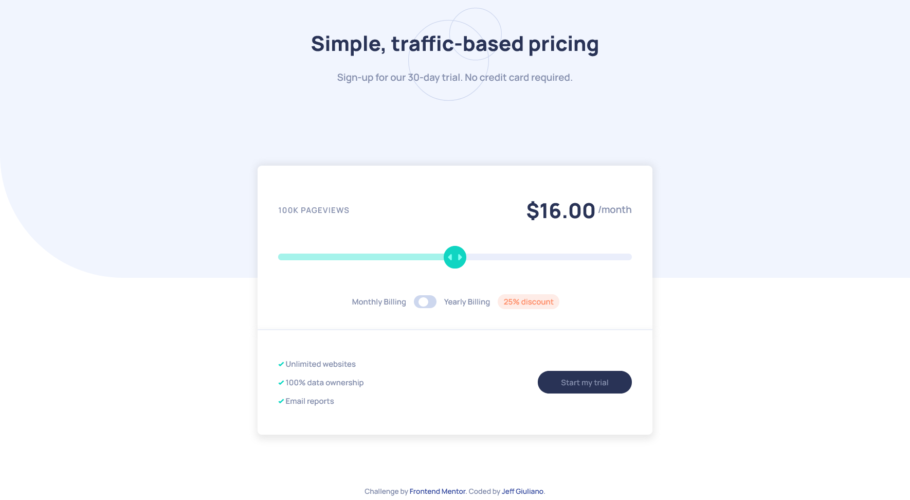

# Frontend Mentor - Interactive pricing component solution

This is a solution to the [Interactive pricing component challenge on Frontend Mentor](https://www.frontendmentor.io/challenges/interactive-pricing-component-t0m8PIyY8). Frontend Mentor challenges help you improve your coding skills by building realistic projects.

## Table of contents

- [Overview](#overview)
  - [The challenge](#the-challenge)
  - [Screenshot](#screenshot)
  - [Links](#links)
- [My process](#my-process)
  - [Built with](#built-with)
  - [What I learned](#what-i-learned)
  - [Continued development](#continued-development)
  - [Useful resources](#useful-resources)
- [Author](#author)

**Note: Delete this note and update the table of contents based on what sections you keep.**

## Overview

### The challenge

Users should be able to:

- View the optimal layout for the app depending on their device's screen size
- See hover states for all interactive elements on the page
- Use the slider and toggle to see prices for different page view numbers

### Screenshot

 This is what the finished projet looks like in Firefox.

### Links

- Solution URL: [Solution URL](https://github.com/jgiuliano8/Interactive-Pricing-Component)
- Live Site URL: [Live Site URL](https://interactive-pricing-component-jgiuliano8.vercel.app/)

## My process

### Built with

- Semantic HTML5 markup
- CSS3
- Flexbox
- CSS Grid
- Mobile-first workflow
- JavaScript
- Git

### What I learned

I learned quite a bit doing this challenge. I learned about the time and code
needed to implement a cross-browser compatible range input. I was able to get
this design working with IE 11 as well as the other major browsers- Chrome,
Safari, Firefox, Edge and Opera. Getting the code working with IE 11 probaly
took the most time. It also expanded my use and knowledge of JavaScript.

In this CSS I made the track of the IE slider have a thick, transparent border.
This allowed the thumb to be viewable 'outside' of the slider track itself, in
IE.

```css
.slider::-ms-track {
  width: 100%;
  border: 30px solid transparent;
  border-radius: 50px;
  background-color: white;
  color: transparent; /* Removes tick marks in IE */
}
```

And here I used a linear-gradient(), with a calc, of varying width to get the track two different colors on each side of the thumb, for Chrome support. I also used JavaScript to update the CSS custom property --bg-slider-value.

```css
.slider::-webkit-slider-runnable-track {
  appearance: none;
  border: none;
  background-image: linear-gradient(
    to right,
    hsl(174, 77%, 80%) calc(var(--bg-slider-value) * 100% / 4),
    hsl(224, 65%, 95%) calc(var(--bg-slider-value) * 100% / 4)
  );
  background-repeat: no-repeat;
  height: 10px;
  border-radius: 50px;
}
```

Here's the JavaScript that updates the CSS custom property:

```js
function setSliderWidthVar() {
  const sliderElement = document.querySelector(".slider");
  sliderValue = sliderElement.value;

  //Sets CSS custom property --bg-slider-value to current
  //range input value.
  document.body.style.setProperty("--bg-slider-value", sliderValue);
}
```

### Continued development

I'd like to have the submit button actually do something, like display
a modal window.

### Useful resources

I started becoming familiar with the foundational sources of developer
help- [Mozilla Developer Network](https://developer.mozilla.org/en-US/) and [StackOverflow](https://stackoverflow.com/), as well as [Google](https://www.google.com/).

These links were pivotal though:

- [CSS Tricks Article on Range Input](https://css-tricks.com/sliding-nightmare-understanding-range-input/) - I used this link to more fully
  understand sliders and there cross-browser complexities. It definitely helped
  me code and troubleshoot the range input.
- [Styling the track on Internet Explorer](https://brennaobrien.com/blog/2014/05/style-input-type-range-in-every-browser.html) - This is where I got the concept of the transparent border to make the thumb visible beyond the track in IE.

## Author

- GitHub - [Jeff Giuliano](https://github.com/jgiuliano8)
